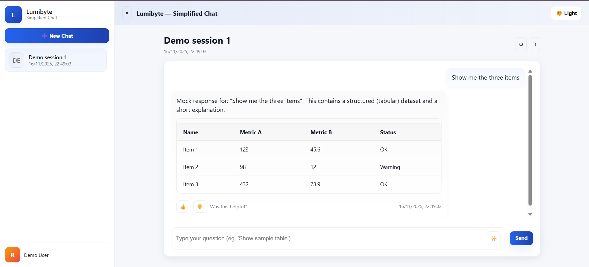
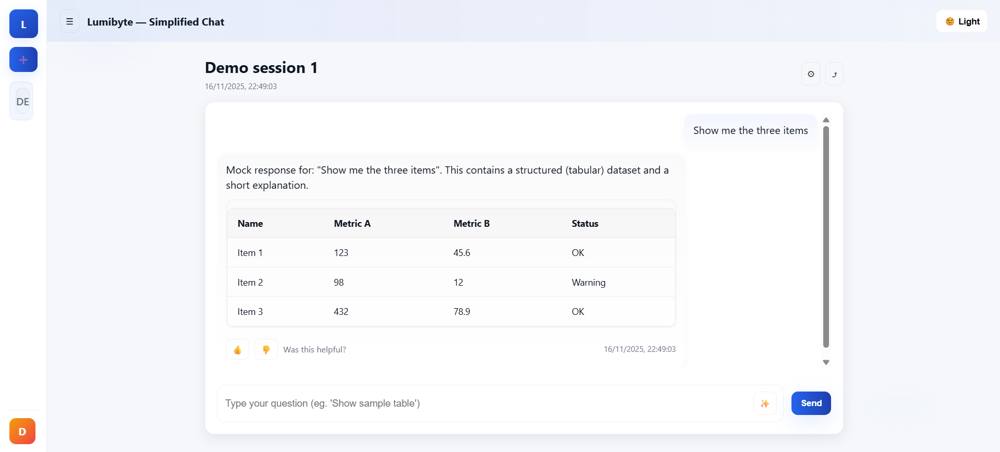
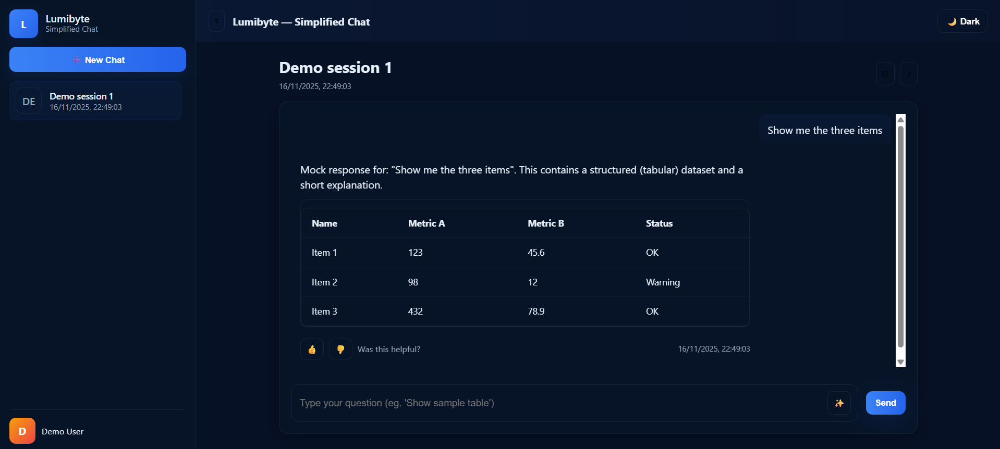

# Lumibyte – Simplified Chat Application  
A modern, minimal ChatGPT-style web application built using **React (JavaScript), Node.js (Express), and plain CSS**.  
This project demonstrates session-based chat, structured tabular responses, collapsible UI panels, and theme toggling.

---

## 🚀 Features

### 🔹 Frontend (React + JavaScript + CSS)
- **Modern Minimal UI** (ChatGPT-style)
- **Collapsible Sidebar**
  - Lists all chat sessions  
  - “New Chat” button  
  - User info section at bottom  
- **Chat Interface**
  - Displays messages with bubble UI  
  - Renders structured **tabular data responses**  
  - Scrollable conversation  
  - Smooth animations and transitions
- **Answer Feedback**
  - Like 👍 / Dislike 👎 actions for each AI response
- **Dark / Light Theme Toggle**
- **Responsive Layout**
  - Works on Desktop, Tablet, and Mobile
- **Session Routing**
  - Every new session loads at: `/chat/:sessionId`

---

## 🔹 Backend (Node.js + Express)
- No database required  
- Uses **mock JSON data + in-memory storage**
- Supports:
  - Create new session
  - Fetch all sessions
  - Fetch single session history
  - Send chat question → return mock table
  - Like/Dislike API for feedback

---

## 📁 Project Structure

```
/project-root
│
├── /backend
│ ├── server.js # Express server + routes
│ ├── mockData.js # Mock session + response data
│ ├── package.json
│
└── /frontend
├── /src
│ ├── App.js
│ ├── index.js
│ ├── index.css
│ ├── /components
│ │ ├── Sidebar.js
│ │ ├── ChatWindow.js
│ │ ├── Landing.js
│ │ ├── TableResponse.js
│ │ ├── AnswerFeedback.js
│ │ └── ThemeToggle.js
│ ├── package.json
│
└── public/

```

---

# 🛠️ Installation & Setup

## 1️⃣ **Backend Setup**

```bash
cd backend
npm install
npm start
```

Backend runs at:
🔗 http://localhost:4000

## 2️⃣ Frontend Setup

```bash
cd frontend
npm install
npm start
```

Frontend runs at:
🔗 http://localhost:3000

---

# 📘 API Endpoints Documentation

### **GET `/api/sessions`**
Returns list of all sessions.

---

### **GET `/api/new-chat`**
Creates a new chat session → returns:

```json
{ "id": "generated-session-id" }
```

### **GET `/api/session/:id`**
Returns full session history for a given session ID.

---

### **POST `/api/chat/:id`**

#### **Request Body:**
```json
{
  "question": "Your question text"
}
```

Response Includes:
- Description text
- Structured table (columns, rows)

---

### POST /api/feedback/:sessionId/:messageIndex
#### Request Body:**
```json
{ "feedback": "like" }
```

Updates feedback for an assistant message.

---

# 📸 Screenshots

## 🏠 Home Screen


## 💬 Chat Screen


## 🌙 Dark Mode


---

## 👨‍💻 Author

**Rohit Raparthi**  
📧 [rohit.raparthi2003@gmail.com](mailto:rohit.raparthi2003@gmail.com)  
💼 [LinkedIn](https://www.linkedin.com/in/rohit-raparthi/) / [GitHub](https://github.com/RohitRaparthi/)